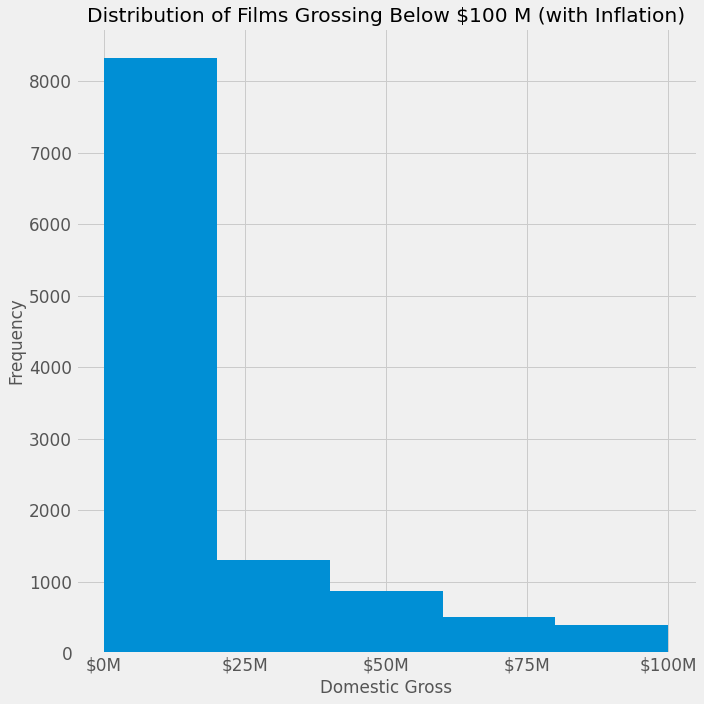
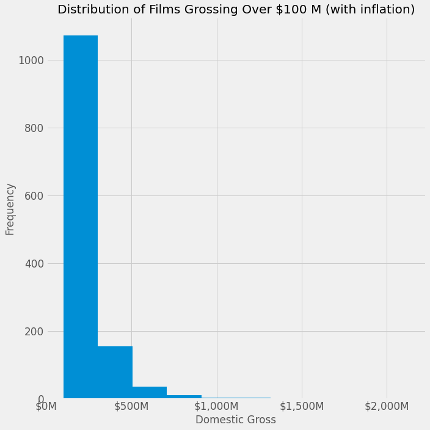
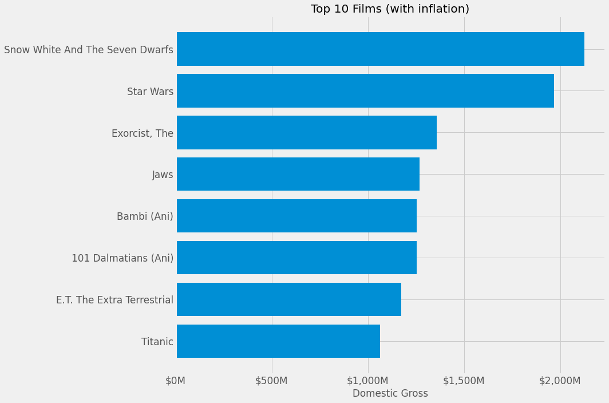
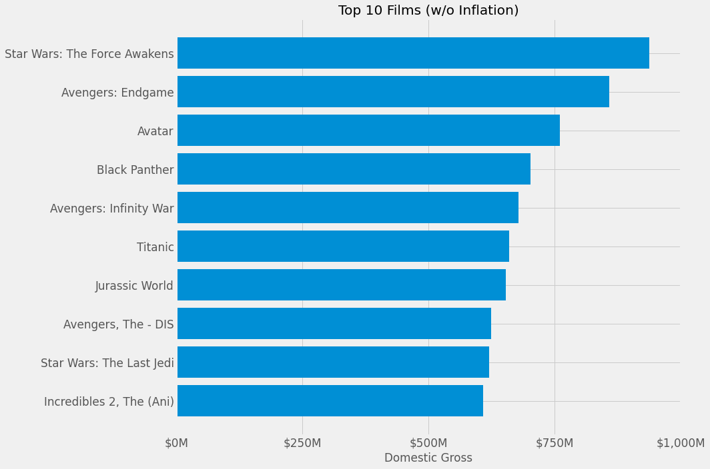
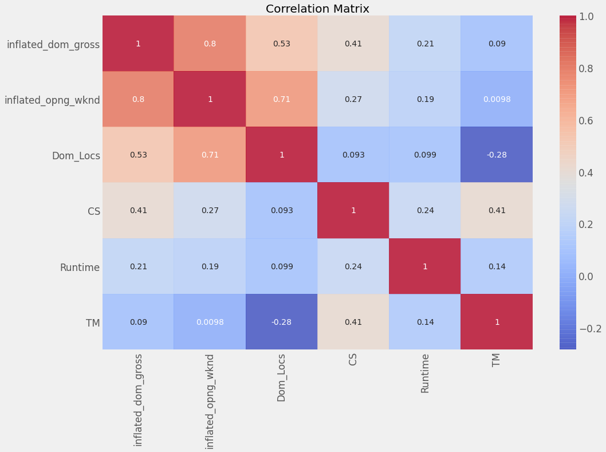
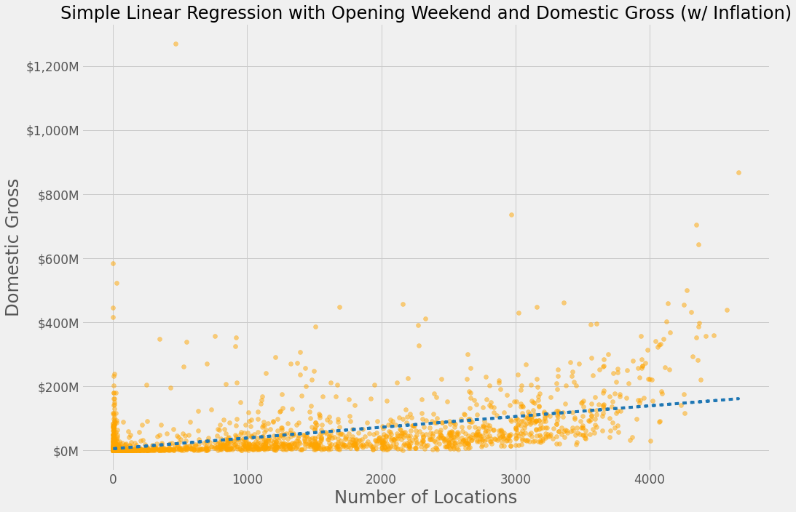
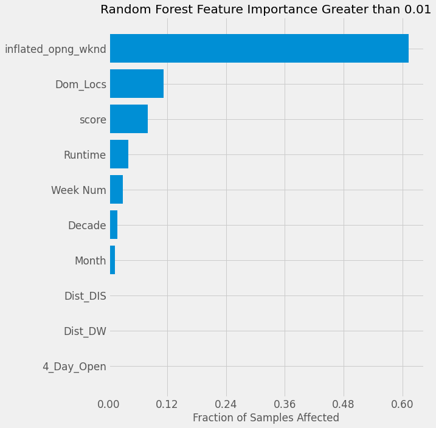
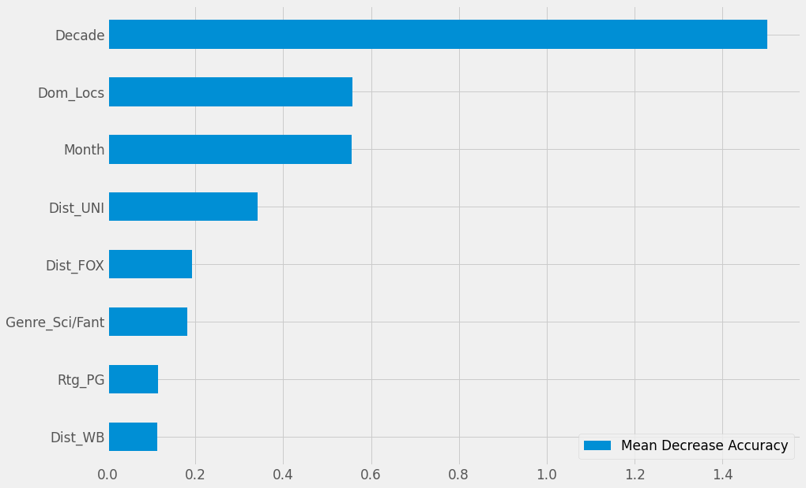
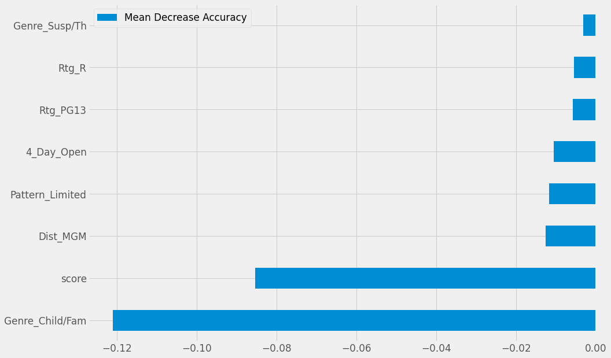

# Predicting_Movie_Grosses

## Data/ Business Objective
This project is for the development of a machine learning model to help predict a Film's Domestic Box Office gross, based upon a mix of catergorical and numeric features.

The Data was retrieved from the WB MMS3 internal database, by Alek Sanchez. 

ID Features:
* Mcode (Unique ID)
* Picture (Film Name)
* Release Date (MM/DD/YYYY)

Categorical Features:
* Format (2D Standard, 3D or IMAX)
* Rating (MPAA Film Rating)
* Wknd Days (Number of Days for Opening Weekend)
* Genre (Type of Film)

Numerical Features:
* Domestic Gross (Final Total Value)[Target]
* Number of Domestic Locations (From Opening Weekend)
* Opening Weekend Gross (Gross from 3 or 4 day Opening Weekend)
* Runtime (Length of a Film)
* TM - Rotten Tomato Review Score
* CS - CinemaScore Score 
* Pattern - How the Film was released
    * Wide - Over 2,000 Locations Opening Weekend
    * Limited - Under 100 Locations Opening Weekend
    * Exclusive - Uner 20 Locations Opening Weekend

## Data Preparation and Clean-Up
The data was compiled from multiple reports exported from the MMS3 Database, ranging from 2019 to 1937. The starting data set was 13.7k rows.

A subset of Film's were retrieved without a Domestic Gross, and were removed, bringing the new total for the dataset to 12.8k.

To prevent Data Leakage, I removed Columns related to the Domestic Gross target: International Gross, Worldwide Gross, Weekend Multiple, and Week Multiple (the latter two which were ratios involving the Domestic Gross).

To get the Release Date into a workable data type, I converted it from a String to a DateTime object, and then also parsed that field into Decade, Year, Month, and Week Num to add more richness to the dataset. 

I turned the WkndDays field into a binary field for "4_Day_Open", where it would have a 1 if it was a 4 Day Opening Weekend, and 0 if not. 

For Format, the column was primarily null, and only indicated if a Film was released in 3D, IMAX, or 3D/IMAX. I imputed '2D' for all the null values.

For the Runtime field, I created a function that split up the string from a H:MM format, to calculating the total number of minutes. I also created a Catergorical feature in case, that separated the Runtime field into three buckets: Under 90 mins, Under 2 hours, and Over 2 hours. 

There were also some extraneous values within the data set, such as place-holder films (ie. "Other Film Grosses - 2015"), and re-issues which were created with a unique Film ID. These rows totalled up to less than 100 rows, and were removed. The data set stands at 12.7k rows.

For the CinemaScore column, the data was stored as a Letter Grade (A+ to F). I converted these into numeric values, for each Letter Grade available. There were no D- grades.

I combined the CS and TM scores into one value, 'score', which looked to see if either was present, and the other was empty, and impute that value. If both were present, an average was taken. If neither was present, it was left as null.

### **Inflation**

Lastly, the currency values within the data set needed to account for inflation. I installed the [CPI Python Library](https://github.com/datadesk/cpi), which compiles inflation rates from the US Bureau of Labor Statistics. 

The Inflated Domestic Gross would be my new target.

## EDA

Delimitting on 100 M Domestic Gross helped paint a broader picture of the distribution of films within the data set. The majority of films (over 3/4s of the data set), reside under 25 M Domestic, while there are still 1,000+ that make betwen 100 M and 250 M Domestic Gross

With inflation, there are a few outliers within the data, given the high inflation rate for older films.

Snow White is the oldest film in the data set, releasing in 1937 and grossing over 2 B after accounting for inflation. This is compared to the un-inflated Domestic Gross numbers, which favor more recent films. The highest non-inflated Domestic Gross was 937 M.

|      | Dom_Gross     | Dom_Locs | Opng_Wknd     | Runtime | TM    | CS    | Inflated_Dom_Gross | Inflated_Opng_Wknd |
|------|---------------|----------|---------------|---------|-------|-------|--------------------|--------------------|
| Mean | 23,726,358.06 | 887.36   | 6,335,375.60  | 104.91  | 57.27 | 85.02 | 36,469,731.63      | 8,451,958.08       |
| STD  | 52,844,072.79 | 1,206.61 | 15,988,514.72 | 19.65   | 27.88 | 7.40  | 85,959,264.59      | 19,045,083.79      |

> Note: From this point on, Domestic Gross and Opening Weekend will refer to their inflated values.

### **Correlation Matrix**

Given the numerical features of the data set, I plotted a Correlation Matrix sorted by the Top 5 features correlated to my target, Domestic Gross.

Not surprisingly enough, Opening Weekend has a strong correlation to a film's final domestic gross. Though the two are still independent of each other (ie. two film's that open to 5M can end at different levels, one at 10M, the other at 40M). 

Unfortunately, this does not give me much insight into discovering what features are important in predicting a film's domestic gross, since ultimately, we would like to have some sort of prediction of a film's domestic gross *before* it opens.

Domestic Locations makes sense that it is somewhat correlated to Domestic Gross, in that, a larger film will play in more theatres, and garner a larger gross. 

It is interesting to note that though CS and TM are both review metrics, they greatly differ in determining a film's overall domestic gross. CS is a singular score taken from a group of surveys from a film's opening weekend, and does not change. This score is typically skewed higher, especially for fans of a film, who are usually the first ones to see it. TM on the other hand, is an aggregate score of reviews, ranging from Top Critics to regular audience members. This score can fluctuate throughout a film's release period. 

## Model Iteration: RMSE
### Baseline (Using the Average): 
#### **RMSE - 99M**
To begin the modelling process, I first established a naive regression as my model, calculating the Root Mean Squared Error of the dataset's target to the mean. 

This established our Baseline to beat, an RMSE of 97M. RMSE is the standard deviation of the residuals, an average of how far off my prediction is from my target. I chose RMSE, as it put my error back in terms of the target. 

It makes sense to have a large number as my RMSE, as given the inflation, the dataset is looking at values ranging from under a million, to over 2 billion. 

### Linear Regression with Dom Locs: 
#### **RMSE - 41M, R2 - 0.65**
From the baseline, I began with a simple Linear Regression between Dom Locs and Domestic Gross. I initially started out with Opening Weekend, but again, realized that this did not provide much in terms of takeaways or predictive value. 

This did provide me with a better model, as the RMSE  decreased by more than half. 

I also established a baseline R2 score with this model. R2 is the coeffecient of determination, which is 1- (the sum of squares of residuals/total sum of squares). This Measure represent the proportion of variance in the dependent variable, and also the "goodness" of fit for a linear regression (where 1 is best).

### Linear Regression, No Imputed Data: 
#### **RMSE - 66M, R2 - 0.45 **
There were a few fields left blank within the dataset. For this next iteration, I modeled a Linear Regression model with no values imputed, and decided to omit them from the model (CS,TM,Runtime). I also one-hot encodded the Categorical features, giving me a 12.7k rows by 480+ features.

This model proved marginally worse than my Linear Regression model with one feature, as noted by the higher RMSE, and lower R2.

### Linear Regression, Imputing Data:
#### **RMSE - 7B, R2 - 0.62**
In this next iteration, I decided to impute the values I omitted in the previous iteration. For the Film's that did not have a score present, I began imputing by an average from the group of 'Genre, Dist, Rtg' to give an average Score. For this which still had a blank score, I began imputing with 'Genre, Dist', or 'Genre, Rtg', and then finally by 'Genre', to retain over 12k rows. 

From my scores, it seemed to be a better 'fitting' R2, but the RMSE was unusally high, given cross-validation. Further investigation is needed on this data set.

Imputing such a large set of data does not seem to make the best sense, and also is not necessary given the business case that stakeholders will not be considering films this far back.

### RobustScaler + Lasso Regularization
#### **RMSE - 33M, R2 - 0.81**
I decided to transform my imputed data using the RobustScaler method in sklearn's preprocessing library. This scale is able to withstand outliers, where the other scalers were sensitive too. It removes the median and scales the data according to each quartile range.

With the numeric values transformed, I plugged in these numbers into a Lasso Regularization model. Since I was dealing with over 480 features, I knew that I did not need to use all of these, and was ok with coeffecients leading to 0.

I did generate the Top 10 Coeffecients, to see if I could pull any insights from this, but with the one-hot categories, this skewed a lot of my coeffecients from being relevent.

|                    |    Coefficient |
|-------------------:|---------------:|
|           Dist_MAC | 150,232,074.82 |
|           Dist_GRP |  70,223,692.90 |
|           Dist_BUB |  47,379,893.23 |
|           Dist_HAN |  41,899,710.89 |
|           Dist_IMX |  39,351,911.22 |
|           Dist_ROM |  35,739,556.94 |
| inflated_opng_wknd |  35,287,795.63 |
|           Dist_ORF |  34,374,808.94 |
|           Dist_CHI |  33,658,646.10 |
|           Dist_CBS |  29,735,442.92 |

This model performed the best so far, and utilized the most data efficiently. 

### Subset of Data > 1970
#### **RMSE - 30M, R2 - 0.89**
Given that I was imputting a lot of data into my data set, some of which did not make the most sense for my business case, I decided to subset my data to more recent and relavent films. I removed values without a score, cutting my dataset in about half with 6.5k rows. 

Again, I transformed it with the RobustScaler, and performed a Linear Regression, and the model performed even better, great to see!

|                    |   Coefficient |
|-------------------:|--------------:|
|           Dist_VES | 83,649,915.12 |
|           Dist_NMG | 71,269,623.57 |
| inflated_opng_wknd | 59,440,515.48 |
|           Dist_RCR | 34,737,160.52 |
|           Dist_BUB | 33,300,161.95 |
|              Rtg_G | 33,184,695.20 |
|           Dist_ROM | 32,970,533.68 |
|           Dist_CHI | 27,802,911.52 |
|          Genre_War | 27,796,528.46 |
|           Dist_HAN | 20,237,652.17 |

Unfortuantely, again, the coeffecients did not provide me any insight into predictive power, so I shifted towards GradientBoosting and RandomForest to determine some Feature Importance.

### GradientBoosting with Subset Data
#### **Train RMSE - 19M, Test RMSE - 26M**
{'learning_rate': 0.02, 'max_depth': 5, 'max_features': 400, 'n_estimators': 500, 'random_state': 1}

The GradientBoosting was able to perform even better than the Lasso Regression. I played around with a range of learning rates, features, and estimators, before ultimately deciding on these consistently performing parameters.
Though it just narrowly lost out to the RandomForest, it performed similarly well. 

### RandomForest with Subset Data
#### **Train RMSE - 14M, Test RMSE - 26M, Unseen Test RMSE - 32M **
Using a GridSearch, I determined that the best parameters for this RandomForest was {'max_depth': 10, 'max_features': 400, 'n_estimators': 500}. I searched through lower and higher depths, with less and more features, with a higher and lower range of estimators, to come to these values.

I decided to choose this RandomForest model as my best performing model, and applied an unseen test set with these parameters. 

It performed relatively well, and did not seem too overfit to the training data. More hyperparameter tweaking could be performed to help further minimize the Unseen RMSE.

Feature wise, again, it was clearly skewed towards the numeric nature of Opening Weekend. But it was good to see Date information have some type of impact in the RF. 

Also to note, compared to the Linear Regression Coeffecients, Disney and Dreamworks seemed to be only two large distributors enough to make it into Top 10, as well as 4 Day Opening. 

Mean Decrease Accuracy tracks how omitting a feature affects the Mean of the Residuals, and also uses an R2 score, as a Regressor. 

These features seem interesting, as they are a lot more diversified than the top Mean Decrease Impurity features. Domestic Locations and Month are more present here, and Decade seems to be the most impactful in decreasing the Mean Accuracy. 

It is interesting to see the other features here, as there are other studios, just as big, such as WB, Universal, and Fox, yet no Disney or Dreamworks. Sci-Fi/Fantasy as a Genre is also present, as well as PG, which leads me to believe those two categories seem to be more impactful for a Film's Domestic Box Office success.

On the flipside, the Children/Family genre seemed to have an adverse affect on the Mean Accuracy, telling me that the Domestic Grosses in this Genre vary widely and are throwing the model for a loop. 

Not so surprisngly, is the score metric I created. Since RT and CS values can differ wildly, the assumption in imputing them does not necesasrily hold up in determining predictive power. 

Also interestingly, the 4 Day open appears here as a negative factor to a decreasing Mean Accuracy, where it was in the Top 10 of features that decrease impurity. Since it's a binary field, it might have been more prevalant in tree splitting as a leaf. 

## Further Thoughts
Though this data started out as being numerically rich, I had to remove most of those values to prevent data leakage. I was left with a bare set, and while I was able to combine features where I could, I was still left with a lot of one-hot encoded features, mainly from the distributors.

One more possible subset is to only use data that has been properly filled out, no nulls, and see how much more accurate these models can become. 

Further investigation is needed in finding ways to group these features, whether through some grouping that I provide, or by applying this data into an unsupervised clustering model to determine groupings of Distributor and/or Genre. 

Expanding this data set to include more numerical values (PostTrak, NRG Tracking) would also provide the Regression and Machine Learning models with richer features to predict upon. 
 
Lastly, more hyperparameter tuning is always welcome in helping determine the optimal parameters for GridSearch. 